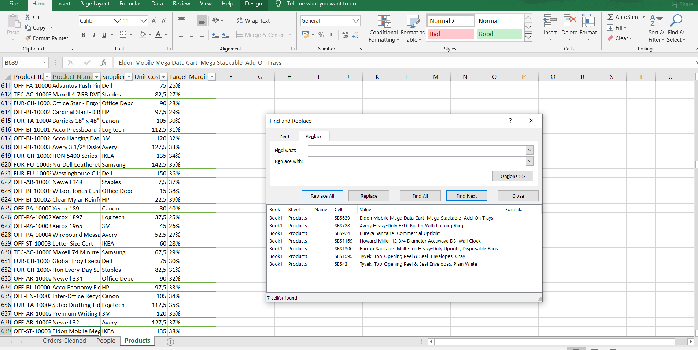
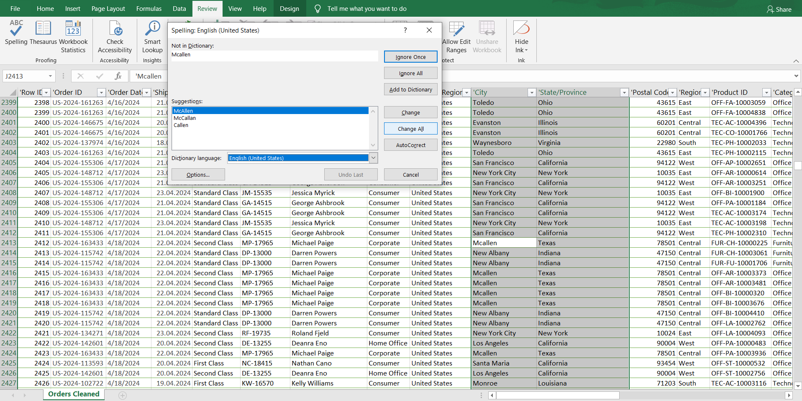
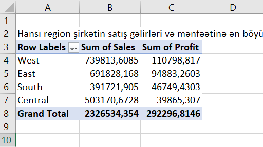
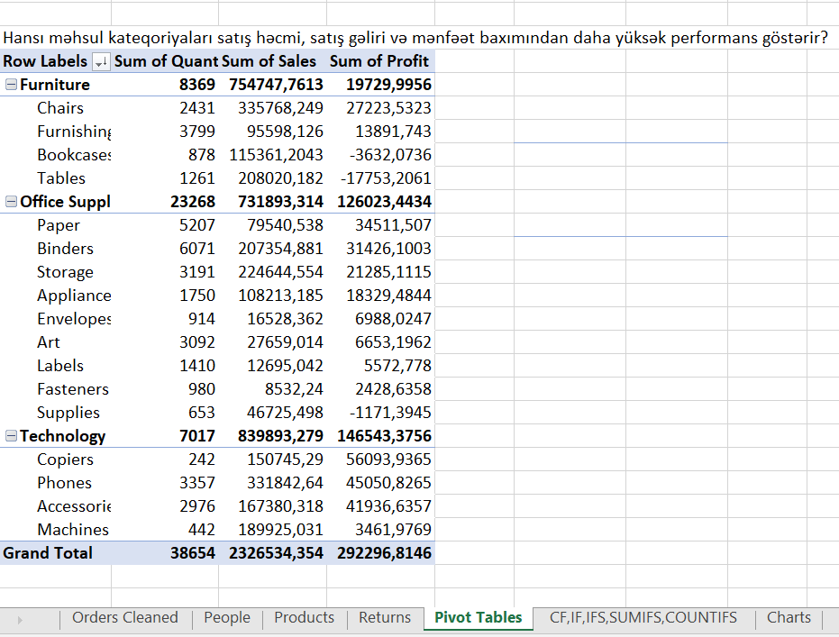
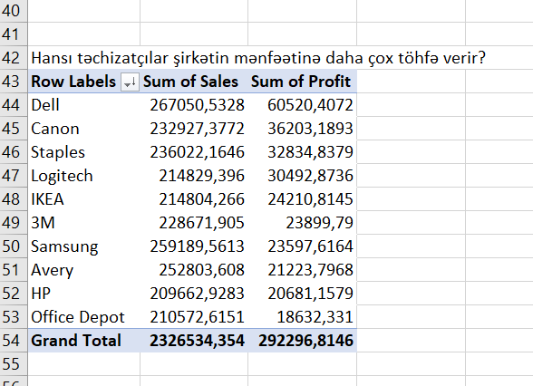
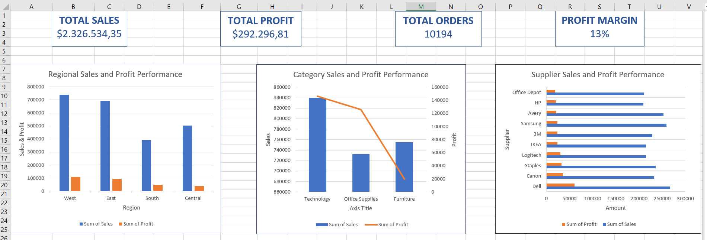

# 📊 Superstore Sales Analysis
## 📌 Layihə haqqında

Bu layihə Microsoft Excel istifadə edilərək hazırlanmış end-to-end satış analizi layihəsidir. Layihənin əsas məqsədi xam satış məlumatlarını təmizləmək, strukturlaşdırmaq, müxtəlif mənbələrdən məlumatları birləşdirmək, biznes suallarına cavab verən analizlər aparmaq və interaktiv dashboard hazırlamaqdır.
Analiz nəticəsində şirkətin satış performansı, mənfəətlilik göstəriciləri, regionlar üzrə nəticələr, məhsul kateqoriyalarının performansı və supplier təsiri qiymətləndirilmişdir.

# 🎯 Layihənin məqsədi

Bu layihə aşağıdakı biznes suallarına cavab vermək məqsədilə hazırlanmışdır:

- Hansı region şirkətin satış gəlirlərinə və mənfəətinə ən böyük töhfəni verir?
- Hansı məhsul kateqoriyaları daha yüksək performans göstərir?
- Hansı məhsullar yüksək və aşağı gəlirlilik yaradır?
- Hansı supplier-lər şirkət üçün daha çox dəyər yaradır?
- Satış nəticələri şirkətin hədəf mənfəət marjasına uyğundurmu?
- Geri qaytarılan məhsullar hansı kateqoriyalarda daha çox müşahidə olunur?

# 📂 Dataset

Layihədə Superstore satış datasından istifadə edilmişdir.

Dataset aşağıdakı cədvəllərdən ibarətdir:

- **Orders** – satış əməliyyatları haqqında məlumatlar
- **Products** – məhsul, supplier, unit cost və target margin məlumatları
- **People** – region üzrə məsul şəxslər
- **Returns** – geri qaytarılan sifariş məlumatları

# 🧹 Data Cleaning prosesi

Analizdən əvvəl məlumat keyfiyyətinin artırılması üçün aşağıdakı təmizləmə əməliyyatları həyata keçirilmişdir:

- İlk mərhələdə orijinal məlumatların qorunması və edilən dəyişikliklərin izlənilə bilməsi üçün bütün təmizləmə əməliyyatları yeni yaradılmış fayl üzərində həyata keçirilmiş və məlumatlar Excel Table formatına çevrilmişdir.
- Duplicate qeydlər yoxlanılmış və Excel-in Remove Duplicates funksiyasından istifadə edilərək tam eyni olan 10 sətr silinmişdir.
- Boş sətirlər yoxlanılmış və uyğun olmayan qeydlər aradan qaldırılmışdır.
- Mətn sütunlarında artıq boşluqlar və format uyğunsuzluqları yoxlanılmış, Find & Replace funksiyası ilə 41 uyğunsuz formatlı mətn dəyəri düzəldilmişdir.
- Excel-in Spelling funksiyasından istifadə edilərək mətn məlumatları yoxlanılmış və standartlaşdırılmışdır. Nümunə: Mcallen → McAllen kimi yazılış səhvləri düzəldilmişdir. Bu proses xüsusilə Product Name və City sütunlarının keyfiyyətinin artırılmasına kömək etmişdir.
- Order Date sütununda bəzi tarixlərin Excel tərəfindən düzgün tarix formatı kimi tanınmadığı müəyyən edilmişdir. Problemin həlli üçün Data → Text to Columns funksiyasından istifadə edilərək tarix formatları standartlaşdırılmışdır.
- Sütun məlumat tipləri uyğunlaşdırılmışdır.
- Dataset daxilində Row ID sütununun unikallığı yoxlanılmış, analiz nəticəsində 82 sətrin Row ID dəyərinin eyni olduğu (10112) müəyyən edilmişdir. Araşdırma nəticəsində bu sətrlərin fərqli satış əməliyyatlarını göstərdiyi məlum olmuşdur. Buna görə məlumat itkisinə səbəb olmamaq üçün həmin qeydlər silinməmiş, yalnız Row ID ardıcıllığı bərpa edilmişdir.

### Data cleaning nümunələri

#### Artıq boşluqların düzəldilməsi

#### Yazılış səhvlərinin düzəldilməsi

# 🔗 Data Integration (Lookup funksiyaları)

Analiz imkanlarını artırmaq üçün müxtəlif sheet-lərdən əlavə məlumatlar Orders cədvəlinə birləşdirilmişdir. Əlavə edilən məlumatlar Supplier, Unit Cost, Target Margin, Returned Status, Regional Manager olmuşdur.Bu məlumatlar məhsul gəlirliliyi, supplier performansı və regional analizlərin daha dərin aparılmasına imkan yaratmışdır.

İstifadə olunan funksiyalar:

- VLOOKUP
- MATCH
- INDEX
- IFERROR

# 🧮 Calculated Fields

Analiz üçün əlavə hesablanan sütunlar yaradılmışdır.

## Profit Margin

Məhsulların faktiki mənfəətlilik səviyyəsini müəyyən etmək üçün Profit Margin aşağıdakı qaydada hesablanmışdır:

Profit Margin = Profit / Sales

## Margin Status

Faktiki mənfəət marjasının şirkətin hədəf göstəricilərinə uyğunluğunu qiymətləndirmək məqsədilə Profit Margin göstəricisi Target Margin ilə müqayisə edilmişdir. Nəticələr "Above Target" və "Below Target" olaraq təsnif edilmiş və Conditional Formatting vasitəsilə vizual olaraq fərqləndirilmişdir. Bu analiz şirkətin müəyyən etdiyi gəlirlilik hədəflərinə uyğun olmayan məhsulları müəyyən etməyə imkan verir.

## Profit Category

Məhsullar gəlirlilik səviyyəsinə görə qruplaşdırılmışdır: High Profit, Medium Profit, Low Profit, Loss Making. Bu təsnifat aşağı performans göstərən məhsulların müəyyən edilməsini asanlaşdırır.

# 📊 Pivot Table Analizi

Biznes suallarına cavab vermək üçün Pivot Table-lardan istifadə edilmişdir.

## 1. Region Performansı

Regionlar üzrə satış və mənfəət müqayisəsi aparılmışdır.

Əsas nəticələr:

- West regionu 14.98% mənfəət marjası ilə  bütün regionlar arasında ən yüksək göstəriciyə malikdir. Bu nəticə West regionunun satış həcmi və mənfəət baxımından şirkət üçün ən effektiv fəaliyyət göstərən regionlardan biri olduğunu göstərir.
- East regionu 13.71% mənfəət marjası ilə stabil maliyyə performansı göstərir.
- Central regionunda satış yüksək olsa da mənfəətlilik aşağıdır(7.92% mənfəət marjası).
- South regionunda satış artımı üçün potensial mövcuddur(11.93% mənfəət marjası).

Tövsiyələr:

- West regionunda uğurlu olan satış strategiyalarının digər regionlarda tətbiqi;
- Central regionunda aşağı mənfəət marjasının səbəblərinin araşdırılması;
- South regionunda yeni müştəri cəlbetmə və marketinq strategiyalarının hazırlanması.
  

## 2. Kateqoriya Performansı

Məhsul kateqoriyalarının satış, miqdar və mənfəət göstəriciləri analiz edilmişdir.

Əsas nəticələr:

- Technology kateqoriyası ən yüksək mənfəət yaradan kateqoriyadır.
- Office Supplies ən yüksək satış həcminə malikdir.
- Furniture kateqoriyasında yüksək satışa baxmayaraq aşağı mənfəətlilik müşahidə olunur.

Tövsiyələr:

- Technology kateqoriyasına investisiyanın artırılması;
- Yüksək mənfəətli məhsulların marketinqinin genişləndirilməsi;
- Furniture kateqoriyasında qiymət və endirim strategiyasının yenidən nəzərdən keçirilməsi.

## 3. Supplier Performansı

Supplier-lərin satış və mənfəət göstəricilərinə təsiri araşdırılmışdır.

Əsas nəticələr:

- Bəzi supplier-lər yüksək satışla yanaşı yüksək mənfəət yaradır.
- Supplier seçimində yalnız satış deyil, mənfəət göstəricisi də nəzərə alınmalıdır.

# 📈 Dashboard

Analiz nəticələrini daha rahat təqdim etmək üçün Excel dashboard hazırlanmışdır.

Dashboard aşağıdakı göstəriciləri əhatə edir:

- Region üzrə satış və mənfəət: Məqsəd regionların satış və mənfəət performansını müqayisə etməkdir.
- Kateqoriya performansı: Məqsəd məhsul kateqoriyalarının satış və mənfəət göstəricilərini analiz etməkdir.
- Supplier performansı:  Məqsəd supplier-lərin şirkətə yaratdığı satış və mənfəət töhfəsini qiymətləndirməkdir.
- Əsas biznes göstəriciləri

# 💡 Əsas biznes nəticələri və tövsiyələr

## Region analizi
 West regionu liderdir, Central regionunda isə gəlirlilik problemi mövcuddur. Buna görə də Central regionunda qiymət siyasəti, endirim strategiyası, məhsul portfeli yenidən analiz edilməlidir. Həmçinin, West regionunda uğurlu satış strategiyaları digər regionlarda tətbiq edilə bilər.

## Məhsul analizi

Technology ən gəlirli kateqoriyadır, Furniture isə optimallaşdırmaya ehtiyac duyur. Technology kateqoriyasında yüksək mənfəət yaradan məhsulların inkişaf etdirilməsi tövsiyə olunur. Furniture kateqoriyasında isə aşağı gəlirli məhsullar, endirim siyasəti, maya dəyəri yenidən qiymətləndirilməlidir.

## Supplier analizi

Yüksək mənfəət gətirən supplier-lərlə əməkdaşlıq genişləndirilməli, aşağı gəlirlilik yaradan supplier-lərlə satınalma şərtləri yenidən nəzərdən keçirilməlidir.

# 🛠 İstifadə olunan Excel bacarıqları

Bu layihədə aşağıdakı Excel bacarıqlarından istifadə edilmişdir:

- Data Cleaning
- Excel Tables
- Pivot Tables
- Pivot Charts
- Dashboard Design
- Conditional Formatting
- VLOOKUP
- INDEX-MATCH
- MATCH
- IF / IFS
- SUMIFS
- COUNTIFS
- Data Visualization
